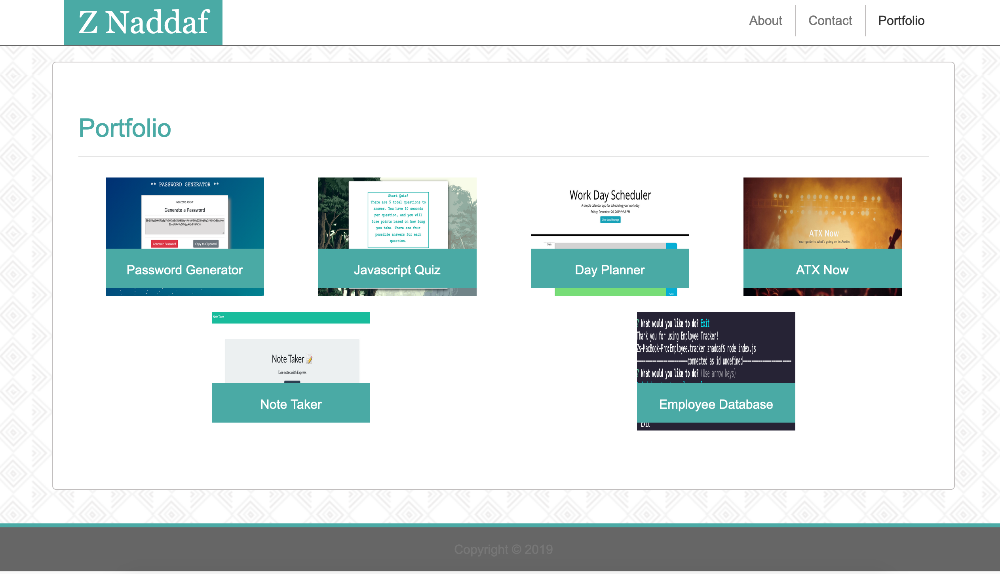

# Unit 02 CSS and Bootstrap Homework: Updated Portfolio

Responsive design ensures that web applications render well on a variety of devices and window or screen sizes. As a developer, you will likely be asked to create a mobile-first application or add responsive design to an existing application. 

# Link:

https://n0matic.github.io/Updated.Portfolio.io/

## Minimum Requirements

* Functional, deployed application

* GitHub repository with README describing the project

## Screenshots

About Page:

  

Contact Page:

  

Portfolio Page:

